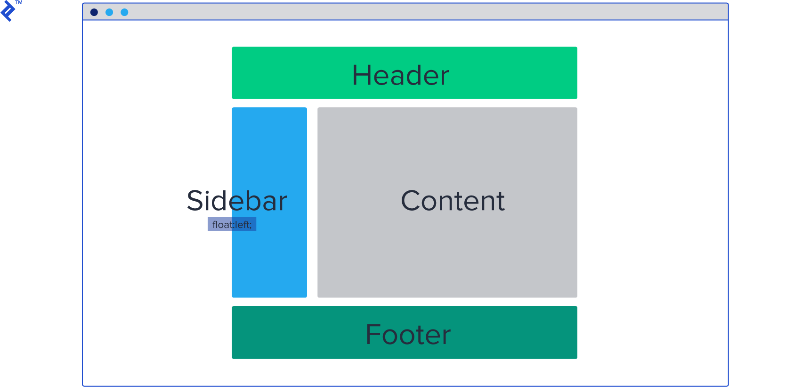
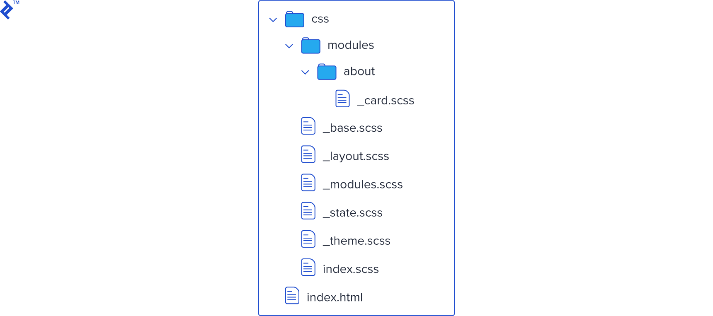

# SMACSS Scalable and Modular Architecture for CSS

http://smacss.com/

Um dos primeiros conhecimentos que se adquire em SMACSS é a respeito da estrutura e organização de seus arquivos, basicamente a organização dos arquivos divide-se em cinco categorias, sendo elas:

1.  Base
2.  Layout
3.  Module (Módulo)
4.  State (Estado)
5.  Theme (Tema)

## Base

São regras aplicadas utilizando os seguintes seletores: **elemento**, **descendente**, **filho** ou **pseudoclasses**. Logo podemos ver que não esta incluso utilizar os seletores de **id** ou **classe**.

Servem para definir como será a aparência **padrão** de determinados elementos que aparecem na página, em outras palavras, podemos dizer que aqui se encaixa o [Reset CSS](https://tableless.com.br/css-reset/):

```css
body {
  margin: 0;
}

h1 {
  font-size: 2em;
  margin: 0.67em 0;
}

* {
    box-sizing: border-box
    font-weight: 300
}
*:focus{
    outline: none
}
```

## Layout

Regras que definem a forma visual de um elemento, sem impactar em sua semântica ou estrutura.
Como já mencionado, os *layouts* são escritos baseando-se em seu prefixo, sendo ele o `l-` seguido pelo *layout* que deseja-se aplicar ao elemento:



```css
.l-inline {
	/* Definir um elemento inline */
}

.l-right {
	/* Definir um elemento à direita */
}

.l-fixed {
	/* Definir um elemento com posição fixa */
}
```

#### Módulo

Regras que são as principais de um projeto, as que dão o “volume” de CSS. Os módulos são escritos apenas pelo nome do elemento que esta sendo aplicado a regra css.



```css
.campo {
	/* Para campos em formulário */
}

.exemplo {
	/* Para definir algum exemplo de código escrito */
}

.painel {
	/* Para definir algum painel na aplicação */
}

.login {
	/* Para definir alguma regra da autenticação */
}
```

#### Estado

Regras que descrevem como determinado *layout* ou módulo comporta-se em determinada condição ou estado, por exemplo: ativo ou inativo, oculto ou visível. Os estados são escritos baseando-se em seu prefixo, sendo ele o `is-` seguido pelo estado que deseja-se aplicar ao elemento:

```css
.is-escondido {
	/* Esconder um determinado elemento na página */
}

.is-ativo {
	/* Definir um elemento como ativo */
}

.is-visivel {
	/* Mostrar um elemento na página */
}
```

#### Tema

Regras similares ao Estado, porém, descrevem como os *layouts* ou módulos devem ser visualmente em determinadas situações.
O significado de tema em SMACSS é o mesmo que em qualquer outro site: **Um conjunto de cores, imagens e elementos** que compoem uma determinada página.

A ideia dos temas é que um arquivo realize a sobreescrita das regras de outro tema, vamos imaginar que em uma determinada pasta temos:
Veja que temos um `.css` para cada tema, dentro deles os seletores devem ser os mesmos:

```
/* azul.css */
.modulo {
	border-color: blue;
}

/* preto.css */
.modulo {
	border-color: black;
}

/* verde.css */
.modulo {
	border-color: green;
}
```

### Organização

Neste momento, com a divisão das cinco categorias informadas e descritas, devemos separar nosso código CSS em vários arquivos, separando-os em suas respectivas categorias. Com essa organização conseguimos diminuir a repetição de códigos e regras CSS já utilizadas, sendo assim, consequentemente nosso código irá ficar mais fácil para ser mantido(manutenção) e atualizado(criação).